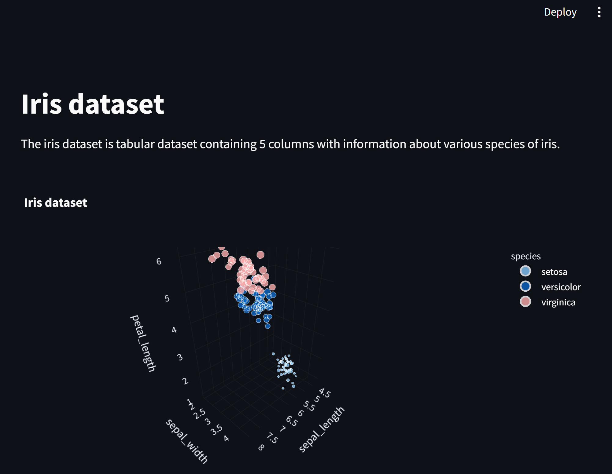

# Data Visualization App using Streamlit

This Python application is designed to provide interactive 3D data visualizations using Streamlit. It offers insightful visualizations for two distinct datasets: the Iris dataset and the MPG dataset.

## Features
The Iris dataset is a well-known dataset containing information about various species of iris flowers. The 3D plot below visualizes the relationship between sepal length, sepal width, and petal length, with different species represented by colors and petal width represented by marker size.



### Installation
1. Clone the repo to local:
```shell
git clone https://github.com/SivaTSS/streamlit_sample.git
```
2. Install the required dependencies:
```shell
pip install -r requirements.txt
```

### Usage
On the terminal run the below command to launch streamlit:
```shell
streamlit run app.py
```
The app will be available on http://localhost:8501/